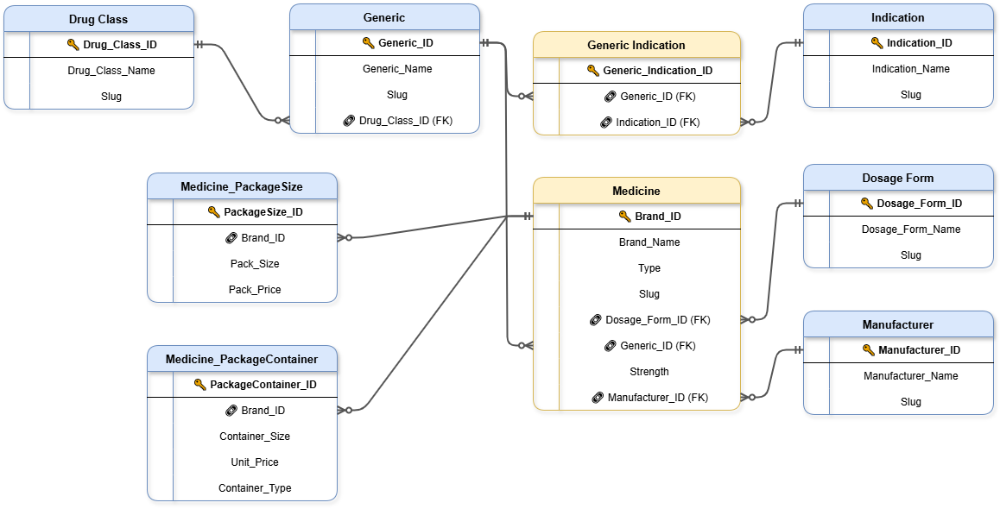

# 🏗️ PharmaMarket_ETL
## 🏷️ Project Badges


## 📖 Overview
This project contains a **full ETL pipeline** for the PharmaMarketAnalytics database.  
It extracts data from CSV files, performs cleaning and deduplication, and loads it into a structured SQL Server database.  
The database schema supports drug information, generics, manufacturers, dosage forms, indications, and medicines, including a many-to-many relationship between generics and indications.

---

## 🗂️ Project Structure

```
PharmaMarket_ETL/
│
├── docs/                        # ER diagrams and visuals
│ └── Pharma_ERD.png
│
├── source_data/                 # CSV input files
│ ├── DosageForm.csv
│ ├── DrugClass.csv
│ ├── Generic.csv
│ ├── Indication.csv
│ ├── Manufacturer.csv
│ └── Medicine.csv
│
├── scripts/                     # SQL ETL scripts
│ ├── 00_CreateDatabase.sql
│ ├── 01_DrugClass_ETL.sql
│ ├── 02_DosageForm_ETL.sql
│ ├── 03_Manufacturer_ETL.sql
│ ├── 04_Indication_ETL.sql
│ ├── 05_Generic_ETL.sql
│ ├── 06_Medicine_ETL.sql
│ └── 07_Generic_Indication_ETL.sql
│
└── README.md
```
---

## 🏗️ Database Schema

The schema includes the following tables:

| Table Name             | Description |
|------------------------|-------------|
| Drug_Class             | Drug classes with unique names |
| Dosage_Form            | Medicine dosage forms |
| Manufacturer           | Pharmaceutical manufacturers |
| Indication             | Medical indications/conditions |
| Generic                | Generic drugs linked to drug classes |
| Medicine               | Brand medicines linked to generics, manufacturers, and dosage forms |
| Generic_Indication     | Junction table linking generics to indications (many-to-many) |

For a visual representation, see the ERD diagram below:



---

## 🔄 ETL Workflow

1. **Create Database**  
   Run `00_CreateDatabase.sql` to create the `PharmaMarketAnalytics` database if it does not exist.

2. **Load Tables**  
   Execute the ETL scripts in order:
   1. `01_DrugClass_ETL.sql`
   2. `02_DosageForm_ETL.sql`
   3. `03_Manufacturer_ETL.sql`
   4. `04_Indication_ETL.sql`
   5. `05_Generic_ETL.sql`
   6. `06_Medicine_ETL.sql`
   7. `07_Generic_Indication_ETL.sql`

Each script follows this pattern:  

- 🗃️ Drop existing staging/final table if exists  
- 📥 Create staging table to match CSV format  
- 🔄 Bulk insert from CSV  
- 🧹 Clean data using T-SQL (trim, replace, deduplicate)  
- 🏷️ Insert into final table with foreign key mapping  
- 🗑️ Drop staging table  

## 💡 Notes

- **Generic_Indication** is a junction table for a many-to-many relationship.

- CSV files in `source_data/` follow PascalCase naming to match the SQL scripts.

- Scripts are fully repeatable and safe to run multiple times due to `IF NOT EXISTS` checks and deduplication logic.

## 📂⚡ File Path Configuration (Important)

This project uses `BULK INSERT` to load CSV files from the `source_data/` folder.

⚠️ **SQL Server requires an absolute file path when using `BULK INSERT`.**

After cloning the repository, you must update the file path inside each ETL script so it matches the location of the project on your local machine.

### 🔎 Example

If the repository is cloned to:
```
E:\Data Analysis\My Projects\PharmaMarket_ETL\
```

Then the `BULK INSERT` statement inside the ETL scripts should reference:

```sql
FROM 'E:\Data Analysis\My Projects\PharmaMarket_ETL\source_data\'
```
### ⚠️ Important Notes

- The path must be accessible by the SQL Server instance.  
- If SQL Server runs locally, the file must exist on your machine.  
- If SQL Server runs remotely or in Docker, the file must exist on that server or container.  
- Spaces in folder names are fully supported as long as the path is enclosed in single quotes.  
- Each ETL script contains a clearly marked section indicating where to update the file path.

### 💡 Why Absolute Paths?

- `BULK INSERT` does **not** read files relative to the SQL script location.
- It reads files relative to the SQL Server service environment.  
- For clarity and transparency, this project uses **documented absolute paths** instead of dynamic configuration.

## 🛠️ Technologies Used

- **SQL Server / T-SQL**  
- **BULK INSERT** for CSV data import  
- **CTEs** for data cleaning and deduplication  
- **Primary Keys, Foreign Keys, Unique Constraints** for data integrity  

## 🚀 Future Enhancements

- Advanced analytics queries for drug usage trends and reporting  
- Power BI dashboard integration for interactive visualizations  
- Python integration for automated data pipeline execution  

## 📚 Data Source

The source CSV files were obtained from the Kaggle dataset:

[Assorted Medicine Dataset of Bangladesh](https://www.kaggle.com/datasets/ahmedshahriarsakib/assorted-medicine-dataset-of-bangladesh)

This dataset is used for educational purposes and to demonstrate ETL workflows.

## 👩‍💻 About Me

Hi! I'm [Gabriela Yordanova](https://www.linkedin.com/in/gabriela-yordanova-837ba2124/). I have 10 years of experience in pharmacy, which gives me genuine domain expertise in pharmaceutical data and a deep interest in making that data structured, accessible, and useful.

This project demonstrates my skills in **SQL, ETL, data cleaning, and database design**, transforming a real-world medicine dataset into a structured, relational database. I enjoy turning raw data into actionable insights and building projects that reflect real-world data workflows.

*This project is part of my portfolio showcasing data engineering and ETL skills.*

## 🛡️ License

This project is licensed under the [MIT License](LICENSE) and is available for educational and portfolio purposes.