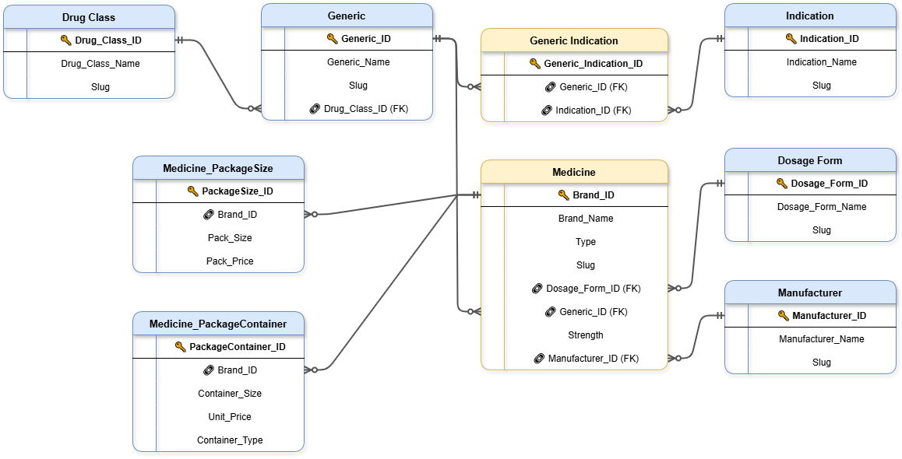

# 🏗️ PharmaMarket_ETL
## 🏷️ Project Badges


## 📖 Overview
This project contains a **full ETL pipeline** for the PharmaMarketAnalytics database.  
It extracts data from CSV files, performs cleaning and deduplication, and loads it into a structured SQL Server database.  
The database schema supports drug information, generics, manufacturers, dosage forms, indications, and medicines — including package sizing, container pricing, and a many-to-many relationship between generics and indications.

---

## 🗂️ Project Structure

```
PharmaMarket_ETL/
│
├── docs/                        # ER diagrams and visuals
│   └── Pharma_ERD.png
│
├── source_data/                 # CSV input files
│   ├── DosageForm.csv
│   ├── DrugClass.csv
│   ├── Generic.csv
│   ├── Indication.csv
│   ├── Manufacturer.csv
│   └── Medicine.csv
│
├── scripts/                     # SQL ETL scripts
│   ├── 00_CreateDatabase.sql
│   ├── 01_DrugClass_ETL.sql
│   ├── 02_DosageForm_ETL.sql
│   ├── 03_Manufacturer_ETL.sql
│   ├── 04_Indication_ETL.sql
│   ├── 05_Generic_ETL.sql
│   ├── 06_Medicine_ETL.sql
│   ├── 07_Medicine_PackageSize_ETL.sql
│   ├── 07b_Medicine_PackageContainer_ETL.sql
│   └── 08_Generic_Indication_ETL.sql
│
├── tests/                       # Validation and sanity check queries
│   └── 09_Validation.sql
│
└── README.md
```
---

## 🏗️ Database Schema

The schema includes the following tables:

| Table Name                  | Description |
|-----------------------------|-------------|
| Drug_Class                  | Drug classes with unique names |
| Dosage_Form                 | Medicine dosage forms |
| Manufacturer                | Pharmaceutical manufacturers |
| Indication                  | Medical indications/conditions |
| Generic                     | Generic drugs linked to drug classes |
| Medicine                    | Brand medicines linked to generics, manufacturers, and dosage forms |
| Medicine_PackageSize        | Pack size options per medicine (e.g. 30's pack, 100's pack) with pack price |
| Medicine_PackageContainer   | Container size options per medicine (e.g. 100 ml bottle, 3 ml cartridge) with unit price and derived container type category |
| Generic_Indication          | Junction table linking generics to indications (many-to-many) |

For a visual representation, see the ERD diagram below:



---

## 🔄 ETL Workflow

1. **Create Database**  
   Run `00_CreateDatabase.sql` to create the `PharmaMarketAnalytics` database if it does not exist.

2. **Load Tables**  
   Execute the ETL scripts in order:
   1. `01_DrugClass_ETL.sql`
   2. `02_DosageForm_ETL.sql`
   3. `03_Manufacturer_ETL.sql`
   4. `04_Indication_ETL.sql`
   5. `05_Generic_ETL.sql`
   6. `06_Medicine_ETL.sql`
   7. `07_Medicine_PackageSize_ETL.sql`
   8. `07b_Medicine_PackageContainer_ETL.sql`
   9. `08_Generic_Indication_ETL.sql`

3. **Validate**  
   Run `tests/09_Validation.sql` to verify row counts, check for duplicates, confirm referential integrity, and review summary statistics.

Each ETL script follows this pattern:

- 🗃️ Drop existing staging/final table if exists
- 📥 Create staging table to match CSV format
- 🔄 Bulk insert from CSV
- 🧹 Clean data using T-SQL (trim, replace, deduplicate)
- 🏷️ Insert into final table with foreign key mapping
- 🗑️ Drop staging table
- ✅ Verify row count

### 💊 Medicine ETL — Scripts 06, 07, 07b

The Medicine pipeline is split across three scripts due to the complexity of the source data. `Medicine.csv` stores package and pricing information in two raw columns — `Package_Container` and `Package_Size` — each containing multiple formats and embedded currency characters that require multi-step parsing.

**`06_Medicine_ETL.sql`** loads the core Medicine table, extracts unit prices, and cleans the raw container strings in preparation for the two child table scripts.

**`07_Medicine_PackageSize_ETL.sql`** parses the `Package_Size` column into the `Medicine_PackageSize` child table, storing each pack size option (e.g. 30's pack, 100's pack) with its price as a separate row. On completion, it drops the `Package_Size` column from Medicine.

**`07b_Medicine_PackageContainer_ETL.sql`** parses the cleaned `Package_Container` column into the `Medicine_PackageContainer` child table, storing each container size option (e.g. 100 ml bottle, 3 ml cartridge) with its unit price as a separate row. Format B medicines — those sold by unit price only with no physical container description — are also captured here with `Container_Size = NULL`. After all rows are inserted, the script corrects known Container_Size typos (misspellings of liter, bottle, pre-filled, and the µg symbol) and derives a `Container_Type` category column using LIKE pattern matching (e.g. Bottle, Vial, Tube, Ampoule, Inhaler, Pre-filled Syringe). On completion, it drops the `Package_Container` and `Unit_Price` columns from Medicine.

## 💡 Notes

- **Generic_Indication** is populated from the `indication` column in `Generic.csv`, which maps each generic drug to its primary medical indication. 1,608 Generic–Indication pairs were loaded successfully.

- **Known data quality issues** carried forward from the source CSV into the database. These are documented in the validation script and flagged for the Data Cleaning project:
  - **59 true duplicate Medicine rows** — same Brand_Name, Strength, Dosage_Form, and Manufacturer — caused by CSV parsing artifacts in the source file. They survive the `DISTINCT` clause due to subtle field differences.
  - **214 medicines with no Generic match** and **147 with no Manufacturer match** — caused by name mismatches between `Medicine.csv` and the reference CSVs.
  - **1 Medicine_PackageSize duplicate group** (Unisaline Fruity) and **3 Medicine_PackageContainer duplicate groups** (Cholera Fluid, Glucose Saline, Normal Saline) — all caused by the upstream Medicine duplicates above.

- CSV files in `source_data/` follow PascalCase naming to match the SQL scripts.

- Scripts are fully repeatable and safe to run multiple times due to `DROP IF EXISTS` checks and deduplication logic.

## 📂⚡ File Path Configuration (Important)

This project uses `BULK INSERT` to load CSV files from the `source_data/` folder.

⚠️ **SQL Server requires an absolute file path when using `BULK INSERT`.**

After cloning the repository, you must update the file path inside each ETL script so it matches the location of the project on your local machine.

### 🔎 Example

If the repository is cloned to:
```
E:\Data Analysis\My Projects\PharmaMarket_ETL\
```

Then the `BULK INSERT` statement inside the ETL scripts should reference:

```sql
FROM 'E:\Data Analysis\My Projects\PharmaMarket_ETL\source_data\'
```
### ⚠️ Important Notes

- The path must be accessible by the SQL Server instance.
- If SQL Server runs locally, the file must exist on your machine.
- If SQL Server runs remotely or in Docker, the file must exist on that server or container.
- Spaces in folder names are fully supported as long as the path is enclosed in single quotes.
- Each ETL script contains a clearly marked section indicating where to update the file path.

### 💡 Why Absolute Paths?

- `BULK INSERT` does **not** read files relative to the SQL script location.
- It reads files relative to the SQL Server service environment.
- For clarity and transparency, this project uses **documented absolute paths** instead of dynamic configuration.

## 🛠️ Technologies Used

- **SQL Server / T-SQL**
- **BULK INSERT** with `FORMAT = 'CSV'` and `FIELDQUOTE` for robust CSV parsing
- **CTEs** for data cleaning and deduplication
- **Window functions** for block-level parsing of multi-value package strings
- **Primary Keys, Foreign Keys, Unique Constraints** for data integrity

## 🚀 Upcoming Projects
This ETL pipeline is the foundation for a series of follow-up projects using the PharmaMarketAnalytics database:

- 🧹 **Data Cleaning** — Deeper data quality work: resolving the 59 duplicate Medicine rows, standardizing drug names and dosage formats, validating foreign key relationships, and ensuring consistency across the dataset.
- 🔍 **Exploratory Data Analysis (EDA)** — Uncovering patterns in drug classes, generics, manufacturers, and indications through analytical SQL queries and summary statistics.
- 📊 **Data Visualization** — An interactive dashboard presenting key insights from the database, including drug distribution, manufacturer market share, and indication trends.

## 📚 Data Source

The source CSV files were obtained from the Kaggle dataset:

[Assorted Medicine Dataset of Bangladesh](https://www.kaggle.com/datasets/ahmedshahriarsakib/assorted-medicine-dataset-of-bangladesh)

This dataset is used for educational purposes and to demonstrate ETL workflows.

## 👩‍💻 About Me

Hi! I'm [Gabriela Yordanova](https://www.linkedin.com/in/gabriela-yordanova-837ba2124/). I have 10 years of experience in pharmacy, which gives me genuine domain expertise in pharmaceutical data and a deep interest in making that data structured, accessible, and useful.

This project demonstrates my skills in **SQL, ETL, data cleaning, and database design**, transforming a real-world medicine dataset into a structured, relational database. I enjoy turning raw data into actionable insights and building projects that reflect real-world data workflows.

*This project is part of my portfolio showcasing data engineering and ETL skills.*

## 🛡️ License

This project is licensed under the [MIT License](LICENSE) and is available for educational and portfolio purposes.