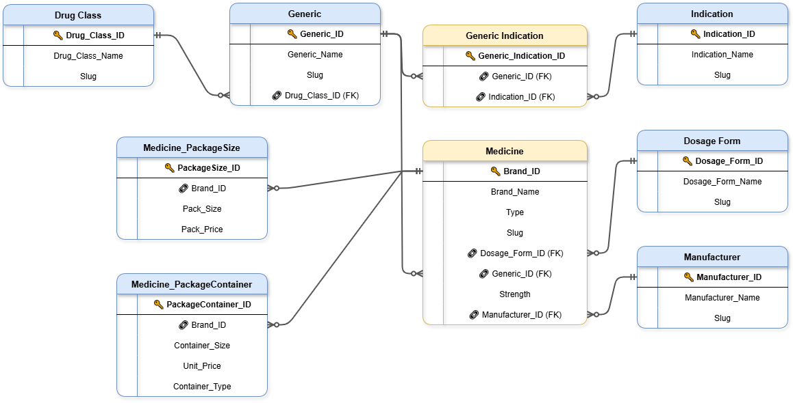

# PharmaMarket ETL


## Overview

This repository contains the ETL layer of the PharmaMarket Data Platform. It loads six source CSV files into a structured SQL Server database and prepares the relational model for the separate cleaning and analysis projects.

The project deliberately uses SQL Server Management Studio for the ETL work. The later EDA stage moves to PostgreSQL and VS Code, showing the same dataset across different tools and workflows.

The schema covers drug classes, dosage forms, manufacturers, indications, generics, medicines, pack sizes, container options and the relationship between generics and their primary indications.

## Project structure

```text
PharmaMarket_ETL/
|-- docs/
|   `-- Pharma_ERD.png
|-- source_data/
|   |-- Dosage_Form.csv
|   |-- Drug_Class.csv
|   |-- Generic.csv
|   |-- Indication.csv
|   |-- Manufacturer.csv
|   `-- Medicine.csv
|-- scripts/
|   |-- 00_CreateDatabase.sql
|   |-- 00_ResetSchema.sql
|   |-- 01_DrugClass_ETL.sql
|   |-- 02_DosageForm_ETL.sql
|   |-- 03_Manufacturer_ETL.sql
|   |-- 04_Indication_ETL.sql
|   |-- 05_Generic_ETL.sql
|   |-- 06_Medicine_ETL.sql
|   |-- 07_Medicine_PackageSize_ETL.sql
|   |-- 07b_Medicine_PackageContainer_ETL.sql
|   `-- 08_Generic_Indication_ETL.sql
|-- tests/
|   |-- 09_Validation.sql
|   |-- 10_ValidationGate.sql
|   `-- test_etl_contract.py
|-- run_full_etl.sql
|-- run_validation.sql
|-- LICENSE.txt
`-- README.md
```

## Database schema

| Table | Purpose |
|---|---|
| `Drug_Class` | Unique drug classes |
| `Dosage_Form` | Medicine dosage forms |
| `Manufacturer` | Pharmaceutical manufacturers |
| `Indication` | Medical indications and conditions |
| `Generic` | Generic drugs linked to drug classes |
| `Medicine` | Brand medicines linked to generics, manufacturers and dosage forms |
| `Medicine_PackageSize` | Pack-size options and pack prices for each medicine |
| `Medicine_PackageContainer` | Container options, unit prices and derived container categories |
| `Generic_Indication` | Generics linked to the primary indication supplied in `Generic.csv` |



## Verified ETL output

The complete rebuild was run twice against the disposable `PharmaMarketAnalytics_ETL_Test` database on 18 September 2026. Both runs completed successfully, which confirms that the reset and rebuild workflow is repeatable.

| Table | Loaded rows |
|---|---:|
| `Drug_Class` | 1,599 |
| `Dosage_Form` | 113 |
| `Manufacturer` | 240 |
| `Indication` | 2,043 |
| `Generic` | 1,711 |
| `Medicine` | 21,708 |
| `Medicine_PackageSize` | 14,349 |
| `Medicine_PackageContainer` | 22,707 |
| `Generic_Indication` | 1,608 |

The original `Medicine.csv` contains 21,714 rows. The ETL removes six exact duplicates with `SELECT DISTINCT`, leaving 21,708 records in `Medicine`.

## Run the complete ETL in SSMS

1. Open `run_full_etl.sql` in SQL Server Management Studio.
2. Enable **Query > SQLCMD Mode**.
3. Review the variables at the top of the file. The committed target is the disposable `PharmaMarketAnalytics_ETL_Test` database.
4. Check the absolute paths used by the `:r` commands and the `BULK INSERT` statements.
5. Execute the runner.

SQLCMD Mode is required because the runner uses variables, included scripts and `:on error exit`. The runner creates the target database when needed, resets the ETL schema, runs scripts 01 through 08 in dependency order and finishes with both validation scripts.

The schema reset only runs when `AllowDestructiveReset` is explicitly set to `YES`. Keep the disposable test database as the default while you test changes. Do not point the full runner at a database whose contents you need to preserve.

To validate an existing build without changing it, open `run_validation.sql`, enable SQLCMD Mode and execute the file.

### Manual execution order

If you do not use the runner, execute the files in this order:

1. `scripts/00_CreateDatabase.sql`
2. `scripts/00_ResetSchema.sql`, with `AllowDestructiveReset=YES` only for an intentional rebuild
3. `scripts/01_DrugClass_ETL.sql`
4. `scripts/02_DosageForm_ETL.sql`
5. `scripts/03_Manufacturer_ETL.sql`
6. `scripts/04_Indication_ETL.sql`
7. `scripts/05_Generic_ETL.sql`
8. `scripts/06_Medicine_ETL.sql`
9. `scripts/07_Medicine_PackageSize_ETL.sql`
10. `scripts/07b_Medicine_PackageContainer_ETL.sql`
11. `scripts/08_Generic_Indication_ETL.sql`
12. `tests/09_Validation.sql`
13. `tests/10_ValidationGate.sql`

Do not rerun a parent-table script against a populated schema. Downstream foreign keys can block its table drop. Use the controlled full rebuild instead.

## ETL design and transaction safety

The reference-table scripts load source data into staging tables, normalize text, remove exact duplicates and map foreign keys before inserting the final rows. The Medicine pipeline needs extra parsing because `Medicine.csv` stores several package formats and embedded prices in two text fields.

`06_Medicine_ETL.sql` loads the core medicine records and prepares the raw package values. `07_Medicine_PackageSize_ETL.sql` turns pack-size choices into child rows. `07b_Medicine_PackageContainer_ETL.sql` extracts container choices, unit prices and a derived container category. After the child tables are built, the temporary package columns are removed from `Medicine`.

Every data-changing ETL script uses `SET XACT_ABORT ON` and a `TRY/CATCH` transaction. SQL Server rolls back the current script when a load or transformation fails, so a failed step does not leave a partially populated table.

## Validation

The project uses three validation layers.

### Informational SQL validation

`tests/09_Validation.sql` reports row counts, duplicate groups, null mappings, referential-integrity results and data distributions. These queries help you inspect the build without stopping it for known source-data issues.

### Blocking SQL validation

`tests/10_ValidationGate.sql` raises an error when a core expectation fails. It checks the verified source-snapshot row counts, unique keys, foreign keys and required fields. The full runner stops if this gate fails.

### Offline contract tests

The Python tests inspect the SQL files without connecting to SQL Server. They verify script order, transaction guards, destructive-reset protection, source-file contracts and the package parser limits present in the current data.

Run them from the repository root:

```powershell
python -m unittest discover -s tests -p "test_*.py" -v
```

## Data-quality findings retained for cleaning

The ETL keeps uncertain records instead of making unsafe corrections. The separate cleaning project handles the deeper review.

- `Medicine` contains 59 duplicate groups under the validation business key of brand, strength, dosage form and manufacturer. Differences outside that key mean they are not safe to delete automatically.
- 214 medicines do not map to a generic. This group includes combination and herbal products as well as naming differences.
- 147 medicines do not map to a manufacturer. The ETL leaves those foreign keys null rather than guessing a match.
- Validation reports one duplicate group in `Medicine_PackageSize` and three in `Medicine_PackageContainer`. They remain available for review in the cleaning stage.
- `Generic_Indication` reflects the single primary indication supplied for each source generic. The table structure supports repeated indications across many generics, but the source does not provide a rich bidirectional many-to-many relationship.

## File-path configuration

SQL Server requires absolute paths for `BULK INSERT`. The committed scripts currently point to:

```text
E:\Data Analysis\My Projects\PharmaMarket Data Platform\PharmaMarket_ETL\source_data
```

After cloning or moving the repository, update the `BULK INSERT` path in scripts 01 through 06 and 08. Also update the absolute quoted `:r` paths in `run_full_etl.sql` and `run_validation.sql`.

The SQL Server service account must be able to read the source directory. If SQL Server runs on another machine or in a container, the files must be available in that environment. Spaces in the path work when the path is quoted correctly.

## Technologies

- SQL Server and T-SQL
- SQL Server Management Studio with SQLCMD Mode
- `BULK INSERT` for source loading
- CTEs and window functions for transformation and multi-value parsing
- Primary keys, foreign keys and unique constraints for integrity
- Python standard-library tests for offline SQL contract checks

## Related projects

- [PharmaMarket Cleaning](https://github.com/GabrielaY0rdanova/PharmaMarket_Cleaning) continues the data-quality work in SQL Server Management Studio.
- [PharmaMarket EDA](https://github.com/GabrielaY0rdanova/PharmaMarket_EDA) moves the cleaned data to PostgreSQL and uses VS Code for exploratory analysis.
- [PharmaMarket Visualization](https://github.com/GabrielaY0rdanova/PharmaMarket_Visualization) presents the final findings in an interactive dashboard.

## Data source

The source files come from the Kaggle dataset [Assorted Medicine Dataset of Bangladesh](https://www.kaggle.com/datasets/ahmedshahriarsakib/assorted-medicine-dataset-of-bangladesh). This project uses the data for education and portfolio demonstration.

## About me

I'm [Gabriela Yordanova](https://www.linkedin.com/in/gabriela-yordanova-837ba2124/). My pharmacy background helps me interpret the pharmaceutical data, not only transform its structure. You can see the complete project context in [my portfolio](https://gabrielay0rdanova.github.io/).

## License

This project is available for educational and portfolio use under the [MIT License](LICENSE.txt).
